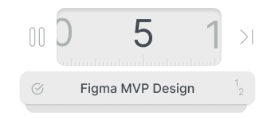
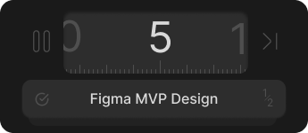
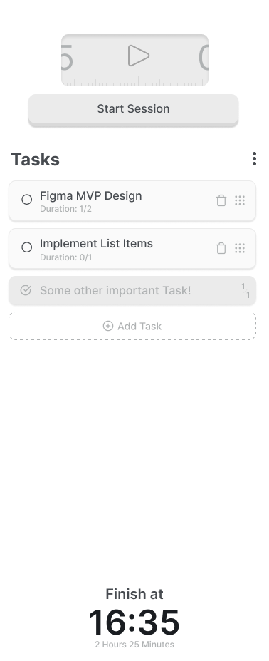

# Pomodoro Desktop App

An open-source project built with Rust and TypeScript using Tauri. Using TailwindCSS for styling and Zustand to keep the state in sync between the Rust backend and the TypeScript frontend. This app is helping you manage your tasks using the Pomodoro Technique, with some cool extras like stats tracking and a widget.

## Features
* Task Management: Easily add, edit, and delete tasks.
* Pomodoro Timer: Use the Pomodoro Technique to break your work into 25-minute intervals with short breaks in between.
* Stats Tracking: Check out your productivity stats to see how you're doing.
* Dark Mode: Switch to dark mode for those late-night work sessions.
* Widget: A small widget you can pin to your desktop to keep track of your timer.

## Recommended IDE Setup

- [VS Code](https://code.visualstudio.com/) + [Tauri](https://marketplace.visualstudio.com/items?itemName=tauri-apps.tauri-vscode) + [rust-analyzer](https://marketplace.visualstudio.com/items?itemName=rust-lang.rust-analyzer)

